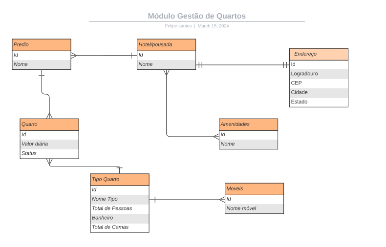
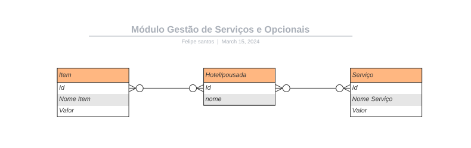
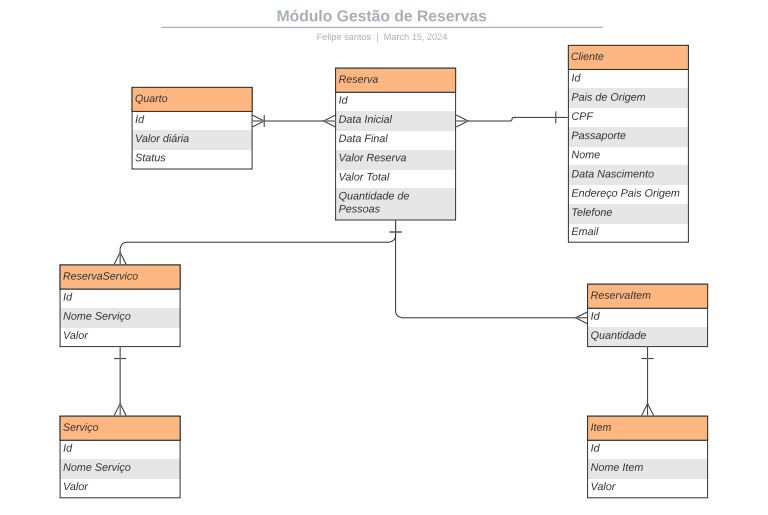

# Documentação do Banco de Dados

Optamos por utilizar utilizar o paradigma relacional nessa solução pois toda a equipe possuia mais conhecimento nesse paradigma, facilitando a criação e a manutenibilidade de toda a solução nesse primeiro momento, considerando que todo o Hackaton tem como objetivo entregar um MVP da solução proposta. 
Sendo assim, escolhemos o PostegreSQL por ser um dos sgbds open source mais conceituados e com mais recursos e suporte.
o modelo ER completo pode ser acessado através desse link:

[Modelo ER Hackaton](./DiagramaERHackaton.pdf)

Organizamos por módulo com o objetivo de facilitar a visualização, seguem abaixo imagens do recorte do modelo correspondente a cada módulo. 

## Gestão de Quartos

## Gestão de Serviços e Opcionais 

## Gestão de Clientes 

## Gestão de Reservas
